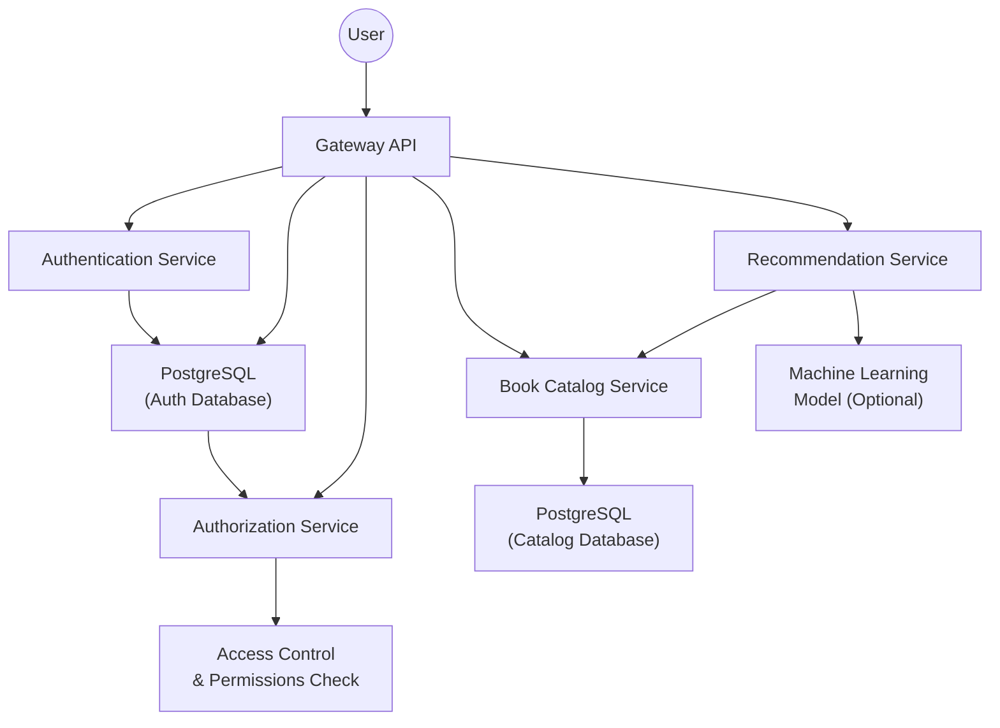

## Folder Structure

```
book-library/
├── cmd/
│   ├── auth/
│   │   └── main.go
│   ├── recommendation/
│   │   └── main.go
│   ├── catalog/
│   │   └── main.go
│   └── gateway/
│       └── main.go
├── internal/
│   ├── auth/
│   │   ├── handler.go
│   │   ├── service.go
│   │   └── repository.go
│   ├── recommendation/
│   │   ├── handler.go
│   │   ├── service.go
│   │   └── repository.go
│   ├── catalog/
│   │   ├── handler.go
│   │   ├── service.go
│   │   └── repository.go
│   └── gateway/
│       ├── handler.go
│       ├── router.go
│       └── middleware.go
├── pkg/
│   ├── config/
│   │   └── config.go
│   ├── db/
│   │   └── db.go
│   └── utils/
│       └── jwt.go
├── api/
│   ├── auth/
│   │   ├── auth.proto
│   │   └── auth.pb.go
│   ├── recommendation/
│   │   ├── recommendation.proto
│   │   └── recommendation.pb.go
│   └── catalog/
│       ├── catalog.proto
│       └── catalog.pb.go
├── cicd/
│   ├── Dockerfiles/
│   ├── k8s/
├── go.mod
└── go.sum
```

### Explanation of Folder Structure
- `cmd/`: Contains the entry points for each microservice. Each service has its own folder with a `main.go` file to start the service.
- `internal/`: Contains the internal logic of each microservice. This includes handlers, services, and repository layers for each service.
- `pkg/`: Contains shared packages used across different services, such as configuration management, database connections, and utility functions like JWT handling.
- `api/`: Contains protocol buffers definitions (`.proto` files) for the services and their generated code (`.pb.go` files).
- `k8s`: Kubernetes Configurations.
- `Dockerfile`: A Dockerfile for containerizing the microservices.
- `go.mod`: The Go module file.
- `go.sum`: The dependency checksum file.


## Flowchart




## Generate ProtoBuf

1. Install the Go Plugin for Protobuf
```bash
go install google.golang.org/protobuf/cmd/protoc-gen-go@latest
go install google.golang.org/grpc/cmd/protoc-gen-go-grpc@latest
```
2. Generate the .pb.go Files
```bash
protoc --go_out=. --go-grpc_out=. api/auth/auth.proto
```
Eg: `protoc --go_out=. catalog.proto`


## Build / Run
### Postgres
```bash
docker pull postgres:16.4-alpine3.20
```
```bash
docker run -p 0:5432 --name pginstance -e POSTGRES_PASSWORD=mysecretpassword -d postgres:12.20-alpine3.20
```